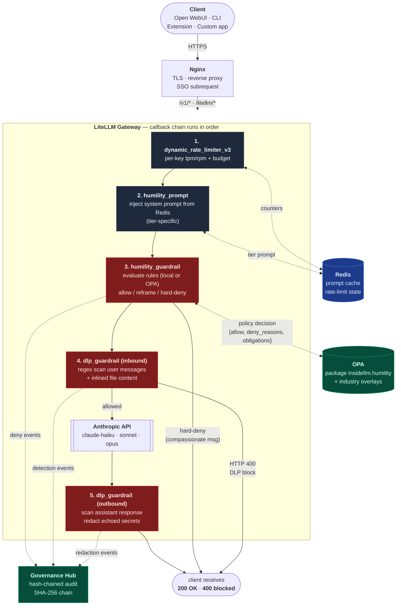
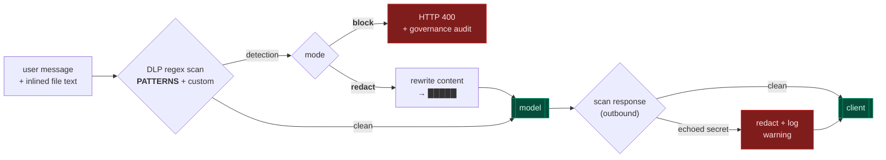
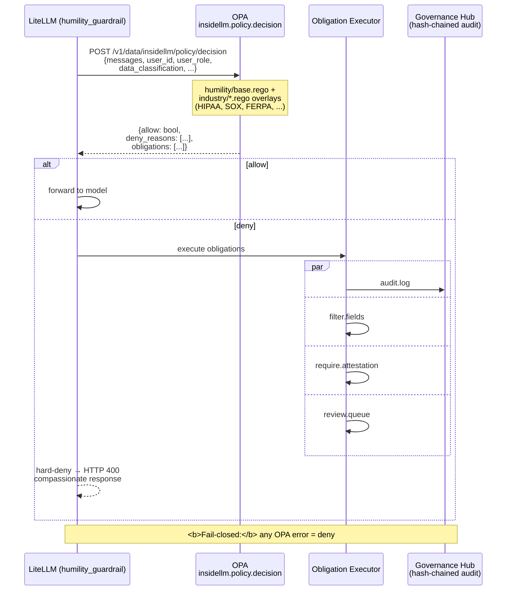

# Guardrail Architecture — OPA, DLP, and Humility

How InsideLLM enforces policy on every chat request. Every layer runs at the
**LiteLLM gateway**, so enforcement applies identically to Open WebUI, Claude
Code CLI, Chrome extensions, and any custom `/v1/` consumer.

## Request flow



## Defense in depth

Humility is enforced at **four independent layers**. Breaking any one layer
doesn't break enforcement — the next layer catches.

| # | Layer | File | Disabling |
|---|-------|------|-----------|
| 1 | Prompt injection (soft) | `configs/litellm/callbacks/humility_prompt.py` | Cannot be disabled |
| 2 | Guardrail (hard) | `configs/litellm/callbacks/humility_guardrail.py` | Cannot be disabled |
| 3 | OPA policy (enterprise overlay) | `configs/opa/policies/humility/base.rego` | `policy_engine_enable=false` falls back to layer 2's local Python rules |
| 4 | Frontend pipeline (optional) | `configs/open-webui/opa-policy-pipeline.py` | Operator toggle in Open WebUI Functions |

Layers 1–2 run in the gateway for **all** clients. Layer 3 adds industry
overlays (HIPAA, SOX, FERPA, GLBA, FDCPA) via OPA. Layer 4 is a
frontend-only belt-and-suspenders for Open WebUI.

## DLP — what it catches and where



Categories (all valves in `terraform.tfvars`, all default-on):

- **Credentials** (`block_credentials`) — API keys, inline passwords, AWS keys, DB connection strings, private keys
- **PII** (`block_ssn`) — Social Security Numbers
- **PHI** (`block_phi`, `block_standalone_dates`) — ICD codes, DoB patterns
- **Financials** (`block_credit_cards`, `block_bank_accounts`) — card numbers, routing/account numbers
- **Custom regex** — `dlp_custom_patterns` JSON map for deployment-specific patterns

## OPA — pure policy, InsideLLM enforces

OPA is strictly a **decision engine**. It takes JSON input, returns a Decision,
and never calls external systems. InsideLLM executes the obligations after OPA
returns.



**Precedence** (higher wins):

1. **Humility** — mandatory, cannot be disabled
2. **Industry policies** — optional, feature-flagged per tenant
3. **Application logic** — last resort

## Why gateway-level (not frontend)

Platform 3.x moved DLP from the Open WebUI pipeline to LiteLLM. Reasons:

- **One enforcement point covers all clients.** A Chrome extension or a
  `curl` to `/v1/chat/completions` hits the same guardrails as Open WebUI.
- **File content is already inlined** by the time the request reaches
  LiteLLM — scanning the `messages` array catches uploaded file text with no
  per-format parser.
- **Audit trails are consistent.** Every enforced decision logs to
  Governance Hub through one path with the same shape.

Legacy `configs/open-webui/dlp-pipeline.py` is still deployed but registered
inactive. Operators can re-enable it as a pre-filter, but it's no longer the
primary defense.

## Ordering matters

Callbacks run in the exact order listed in `litellm-config.yaml`:

```yaml
callbacks:
  - dynamic_rate_limiter_v3
  - callbacks.humility_prompt.proxy_handler_instance
  - callbacks.humility_guardrail.proxy_handler_instance
  - callbacks.dlp_guardrail.proxy_handler_instance
```

This order is deliberate:

1. **Rate limit first** — cheap rejection before anything else runs.
2. **Humility prompt second** — inject guidance before rule evaluation so the
   model is already primed.
3. **Humility guardrail third** — reject disallowed intent before scanning content.
4. **DLP last** — a prompt that passes intent may still carry secrets; scan
   at the last mile before the model sees it.
